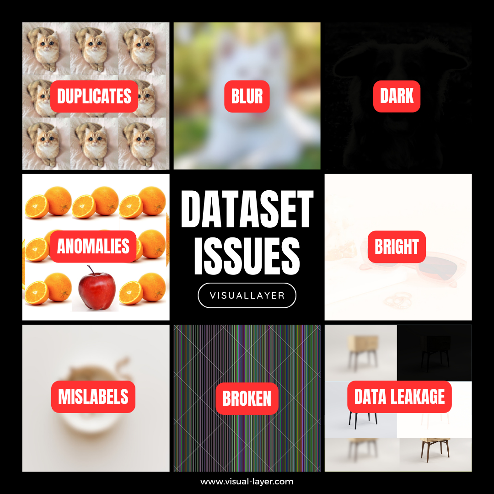

<!-- PROJECT SHIELDS -->
<!--
*** I'm using markdown "reference style" links for readability.
*** Reference links are enclosed in brackets [ ] instead of parentheses ( ).
*** See the bottom of this document for the declaration of the reference variables
*** for contributors-url, forks-url, etc. This is an optional, concise syntax you may use.
*** https://www.markdownguide.org/basic-syntax/#reference-style-links
-->

[![PyPi][pypi-shield]][pypi-url]
[![PyPi][pypiversion-shield]][pypi-url]
[![PyPi][downloads-shield]][downloads-url]
[![License][license-shield]][license-url]
<!-- [![Contributors][contributors-shield]][contributors-url] -->


<!-- MARKDOWN LINKS & IMAGES -->
<!-- https://www.markdownguide.org/basic-syntax/#reference-style-links -->
[pypi-shield]: https://img.shields.io/badge/Python-3.7%20--%203.11-blue?style=for-the-badge
[pypi-url]: https://pypi.org/project/vl-datasets/
[pypiversion-shield]: https://img.shields.io/pypi/v/vl-datasets?style=for-the-badge
[downloads-shield]: https://img.shields.io/badge/dynamic/json?style=for-the-badge&label=downloads&query=%24.total_downloads&url=https%3A%2F%2Fapi.pepy.tech%2Fapi%2Fprojects%2Fvl-datasets&color=lightblue
[downloads-url]: https://pypi.org/project/vl-datasets/
<!-- [contributors-shield]: https://img.shields.io/github/contributors/visual-layer/fastdup?style=for-the-badge -->
<!-- [contributors-url]: https://github.com/othneildrew/Best-README-Template/graphs/contributors -->
[license-shield]: https://img.shields.io/badge/License-Apache%202.0-purple.svg?style=for-the-badge
[license-url]: https://github.com/visual-layer/vl-datasets/blob/main/LICENSE


<!-- PROJECT LOGO -->
<br />
<div align="center">

<a href="https://www.visual-layer.com">
  
</a>

<h3 align="center">Open, Clean, Curated Datasets for Computer Vision</h3>

  <p align="center">
  <br />
    🔥 We use
    <a href="https://github.com/visual-layer/fastdup">fastdup</a> - a free tool to clean all datasets shared in this repo.
    <br />
    <a href="https://visual-layer.readme.io/" target="_blank" rel="noopener noreferrer"><strong>Explore the docs »</strong></a>
    <br />
    <a href="https://github.com/visual-layer/vl-datasets/issues" target="_blank" rel="noopener noreferrer">Report Issues</a>
    ·
    <a href="https://medium.com/@visual-layer/" target="_blank" rel="noopener noreferrer">Read Blog</a>
    ·
    <a href="mailto:info@visual-layer.com?subject=Sign-up%20for%20access" target="_blank" rel="noopener noreferrer">Get In Touch</a>
    ·
    <a href="https://visual-layer.com/" target="_blank" rel="noopener noreferrer">About Us</a>
    <br />
    <br /> 
    <a href="https://visualdatabase.slack.com/join/shared_invite/zt-19jaydbjn-lNDEDkgvSI1QwbTXSY6dlA#/shared-invite/email" target="_blank" rel="noopener noreferrer">
    
    </a>
    <a href="https://visual-layer.readme.io/discuss" target="_blank" rel="noopener noreferrer">
    
    </a>
    <a href="https://www.linkedin.com/company/visual-layer/" target="_blank" rel="noopener noreferrer">
    
    </a>
    <a href="https://twitter.com/visual_layer" target="_blank" rel="noopener noreferrer">
    
    </a>
    <a href="https://www.youtube.com/@visual-layer4035" target="_blank" rel="noopener noreferrer">
    
    </a>
  </p>
</div>

## Description

`vl-datasets` is a Python package that provides access to clean computer vision datasets with only 2 lines of code.

For example, to get access to the clean version of the [Food-101](https://data.vision.ee.ethz.ch/cvl/datasets_extra/food-101/) dataset simply run:


We support some of the most widely used computer vision datasets.
[Let us know](https://forms.gle/8jxPkyzeKj82kPed8) if you have additional request to support a new dataset.

All the datasets are analyzed for issues such as: 

+ Duplicates.
+ Broken images.
+ Outliers.
+ Dark/Bright/Blurry images.



`vl-datasets` provides a convenient way to access these cleaned datasets in Python.

Alternatively, for each dataset in this repo, we provide a `.csv` file that lists the problematic images from the dataset.

You can use the listed images in the `.csv` to improve the model by re-labeling the them or just simply remove it from the dataset.


## Why?

Computer vision is an exciting and rapidly advancing field, with new techniques and models emerging now and then. 
However, to develop and evaluate these models, it's essential to have reliable and standardized datasets to work with.

Even with the recent success of generative models, data quality remains an issue that's [mainly overlooked](https://medium.com/@amiralush/large-image-datasets-today-are-a-mess-e3ea4c9e8d22).
Training models will erroneours data impacts model accuracy, incurs costs in time, storage and computational resources.

We believe that access to clean and high-quality computer vision datasets leads to accurate, non-biased, and efficient model.
By providing public access to `vl-datasets` we hope it helps advance the field of computer vision.

## Datasets & Access
We're a startup and we'd like to offer free access to the datasets as much as we can afford to. But in doing so, we'd also need your support.

We're offering select `.csv` files completely free with no strings attached. 
For access to our complete dataset and exclusive beta features, all we ask is that you [sign up](https://forms.gle/8jxPkyzeKj82kPed8) to be a beta tester – it's completely free and your feedback will help shape the future of our platform. 

Here is a table of widely used computer vision datasets, issues we found and a link to access the `.csv` file.


| Dataset                                                                 | Issues (WIP)                                                                                                                                                                                 | CSV            |
|-------------------------------------------------------------------------|----------------------------------------------------------------------------------------------------------------------------------------------------------------------------------------------|----------------|
| [Food-101](https://data.vision.ee.ethz.ch/cvl/datasets_extra/food-101/) | <ul><li>Duplicates - 0.24% (12,345)</li><li>Outliers - 0.85% (456)</li><li>Broken - 0.85% (456)</li><li>Blur - 0.85% (456)</li><li>Dark - 0.85% (456)</li><li>Bright - 0.85% (456)</li></ul> | Download [here](https://drive.google.com/uc?export=download&id=1ZG5GvU342l4YmSeYo6v6LeKbMM5fwjjw). |
| [Oxford-IIIT Pet](https://www.robots.ox.ac.uk/~vgg/data/pets/)          | <ul><li>Duplicates - 1.021% (75)</li><li>Outliers - 0.095% (7)</li><li>Broken - 0.000% (0)</li><li>Blur - 0.000% (0)</li><li>Dark - 0.054% (4)</li><li>Bright - 0.000% (0)</li></ul> | Download [here](https://drive.google.com/uc?export=download&id=1OLa8k4NITnmCHjeByzvGaWt3W7k6R1QL). |
| [Imagenette](https://github.com/fastai/imagenette)                      | <ul><li>Duplicates - 0.24% (12,345)</li><li>Outliers - 0.85% (456)</li><li>Broken - 0.85% (456)</li><li>Blur - 0.85% (456)</li><li>Dark - 0.85% (456)</li><li>Bright - 0.85% (456)</li></ul> | Download here. |
| [LAION-1B](https://laion.ai/blog/laion-5b/)                             | <ul><li>Duplicates - 0.24% (12,345)</li><li>Outliers - 0.85% (456)</li><li>Broken - 0.85% (456)</li><li>Blur - 0.85% (456)</li><li>Dark - 0.85% (456)</li><li>Bright - 0.85% (456)</li></ul> | Request access [here](https://forms.gle/8jxPkyzeKj82kPed8).  |
| [Imagenet-21k](https://www.image-net.org/)                              | <ul><li>Duplicates - 0.24% (12,345)</li><li>Outliers - 0.85% (456)</li><li>Broken - 0.85% (456)</li><li>Blur - 0.85% (456)</li><li>Dark - 0.85% (456)</li><li>Bright - 0.85% (456)</li></ul> | Request access [here](https://forms.gle/8jxPkyzeKj82kPed8).  |
| [Imagenet-1k](https://www.image-net.org/)                               | <ul><li>Duplicates - 0.24% (12,345)</li><li>Outliers - 0.85% (456)</li><li>Broken - 0.85% (456)</li><li>Blur - 0.85% (456)</li><li>Dark - 0.85% (456)</li><li>Bright - 0.85% (456)</li></ul> | Request access [here](https://forms.gle/8jxPkyzeKj82kPed8).  |
| [KITTI](https://www.cvlibs.net/datasets/kitti/)                         | <ul><li>Duplicates - 0.24% (12,345)</li><li>Outliers - 0.85% (456)</li><li>Broken - 0.85% (456)</li><li>Blur - 0.85% (456)</li><li>Dark - 0.85% (456)</li><li>Bright - 0.85% (456)</li></ul> | Request access [here](https://forms.gle/8jxPkyzeKj82kPed8).  |
| [DeepFashion](http://mmlab.ie.cuhk.edu.hk/projects/DeepFashion.html)    | <ul><li>Duplicates - 0.24% (12,345)</li><li>Outliers - 0.85% (456)</li><li>Broken - 0.85% (456)</li><li>Blur - 0.85% (456)</li><li>Dark - 0.85% (456)</li><li>Bright - 0.85% (456)</li></ul> | Request access [here](https://forms.gle/8jxPkyzeKj82kPed8).  |
| [Places365](https://github.com/CSAILVision/places365)                   | <ul><li>Duplicates - 0.24% (12,345)</li><li>Outliers - 0.85% (456)</li><li>Broken - 0.85% (456)</li><li>Blur - 0.85% (456)</li><li>Dark - 0.85% (456)</li><li>Bright - 0.85% (456)</li></ul> | Request access [here](https://forms.gle/8jxPkyzeKj82kPed8).  |
| [CelebA-HQ](http://mmlab.ie.cuhk.edu.hk/projects/CelebA.html)           | <ul><li>Duplicates - 0.24% (12,345)</li><li>Outliers - 0.85% (456)</li><li>Broken - 0.85% (456)</li><li>Blur - 0.85% (456)</li><li>Dark - 0.85% (456)</li><li>Bright - 0.85% (456)</li></ul> | Request access [here](https://forms.gle/8jxPkyzeKj82kPed8).  |
| [ADE20K](https://groups.csail.mit.edu/vision/datasets/ADE20K/)          | <ul><li>Duplicates - 0.24% (12,345)</li><li>Outliers - 0.85% (456)</li><li>Broken - 0.85% (456)</li><li>Blur - 0.85% (456)</li><li>Dark - 0.85% (456)</li><li>Bright - 0.85% (456)</li></ul> | Request access [here](https://forms.gle/8jxPkyzeKj82kPed8).  |
| [COCO](https://cocodataset.org/#home)                                   | <ul><li>Duplicates - 0.24% (12,345)</li><li>Outliers - 0.85% (456)</li><li>Broken - 0.85% (456)</li><li>Blur - 0.85% (456)</li><li>Dark - 0.85% (456)</li><li>Bright - 0.85% (456)</li></ul> | Request access [here](https://forms.gle/8jxPkyzeKj82kPed8).  |


Learn more on how we clean the datasets using our profilling tool [here](https://visual-layer.link).


## Installation

**Option 1** - Install `vl_datasets` package from PyPI:

```shell
pip install vl-datasets
```

**Option 2** - Install the bleeding edge version on GitHub:
```
pip install git+https://github.com/visual-layer/vl-datasets.git@main --upgrade
```

## Usage
To start using `vl-datasets`, import the clean version of the dataset with:

```python
from vl_datasets import CleanFood101
```

This should import the clean version of the `Food101` dataset.

Next, you can load the dataset as a PyTorch `Dataset`.

```python
train_dataset = CleanFood101('./', split='train')
valid_dataset = CleanFood101('./', split='test')
```

If you have a custom `.csv` file you can optionally pass in the file:

```python
train_dataset = CleanFood101('./', split='train', exclude_csv='my-file.csv')
```
The filenames listed in the `.csv` will be excluded in the dataset.

Next, you can load the train and validation datasets in a PyTorch training loop.

See the [Learn from Examples](#learn-from-examples) section to learn more.


> **NOTE**: Sign up [here](https://forms.gle/8jxPkyzeKj82kPed8) for free to be our beta testers and get full access to the all the `.csv` files for the dataset listed in this repo. 

With the dataset loaded you can train a model using PyTorch training loop.

## Learn from Examples

<table>
  <tr>
      <td rowspan="3" width="160">
      <a href="https://visual-layer.readme.io/docs/getting-started">
              
      </a>
      </td>    
      <td rowspan="3">
        <ul>
            <li> <b>Dataset:</b> <code>CleanFood101</code></li>
            <li> <b>Framework:</b> PyTorch.</li>
            <li> <b>Description:</b> Load a dataset and train a PyTorch model.</li>
        </ul>
      </td>
      <td align="center" width="80">
          <a href="https://nbviewer.org/github/visual-layer/vl-datasets/blob/main/notebooks/train-pytorch.ipynb">
              
          </a>
      </td>
  </tr>
  <tr>
      <td align="center">
          <a href="https://github.com/visual-layer/vl-datasets/blob/main/notebooks/train-pytorch.ipynb">
              
          </a>
      </td>
  </tr>
  <tr>
      <td align="center">
          <a href="https://colab.research.google.com/github/visual-layer/vl-datasets/blob/main/notebooks/train-pytorch.ipynb">
              
          </a>
      </td>
  </tr>

  <!-- ------------------------------------------------------------------- -->

  <tr>
      <td rowspan="3" width="160">
      <a href="https://visual-layer.readme.io/docs/objects-and-bounding-boxes">
              
      </a>
      </td>    
      <td rowspan="3">
        <ul>
            <li> <b>Dataset:</b> <code>CleanOxfordIIITPet</code></li>
            <li> <b>Framework:</b> fast.ai.</li>
            <li> <b>Description:</b> Finetune a pretrained TIMM model using fastai.</li>
        </ul>
      </td>
      <td align="center" width="80">
          <a href="https://nbviewer.org/github/visual-layer/vl-datasets/blob/main/notebooks/train-fastai.ipynb">
              
          </a>
      </td>
  </tr>
  <tr>
      <td align="center">
          <a href="https://github.com/visual-layer/vl-datasets/blob/main/notebooks/train-fastai.ipynb">
              
          </a>
      </td>
  </tr>
  <tr>
      <td align="center">
          <a href="https://colab.research.google.com/github/visual-layer/vl-datasets/blob/main/notebooks/train-fastai.ipynb">
              
          </a>
      </td>
  </tr>

  <!-- ------------------------------------------------------------------- -->
  
</table>

## License
`vl-datasets` is licensed under the Apache 2.0 License. See [LICENSE](./LICENSE).

However, you are bound to the usage license of the original dataset. It is your responsibility to determine whether you have permission to use the dataset under the dataset's license. We provide no warranty or guarantee of accuracy or completeness.

## Getting Help
Get help from the Visual Layer team or community members via the following channels -
+ [Slack](https://visualdatabase.slack.com/join/shared_invite/zt-19jaydbjn-lNDEDkgvSI1QwbTXSY6dlA#/shared-invite/email).
+ GitHub [issues](https://github.com/visual-layer/vl-datasets/issues).
+ Discussion [forum](https://visual-layer.readme.io/discuss).

## About Visual-Layer

<div align="center">
<a href="https://www.visual-layer.com">
  
</a>
</div>


Visual Layer is founded by the authors of [XGBoost](https://github.com/apache/tvm), [Apache TVM](https://github.com/apache/tvm) & [Turi Create](https://github.com/apple/turicreate) - [Danny Bickson](https://www.linkedin.com/in/dr-danny-bickson-835b32), [Carlos Guestrin](https://www.linkedin.com/in/carlos-guestrin-5352a869) and [Amir Alush](https://www.linkedin.com/in/amiralush).

Learn more about Visual Layer [here](https://visual-layer.com).