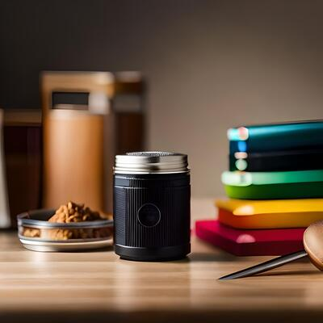

<!-- PROJECT SHIELDS -->
<!--
*** I'm using markdown "reference style" links for readability.
*** Reference links are enclosed in brackets [ ] instead of parentheses ( ).
*** See the bottom of this document for the declaration of the reference variables
*** for contributors-url, forks-url, etc. This is an optional, concise syntax you may use.
*** https://www.markdownguide.org/basic-syntax/#reference-style-links
-->

[![PyPi][pypi-shield]][pypi-url]
[![PyPi][pypiversion-shield]][pypi-url]
[![PyPi][downloads-shield]][downloads-url]
[![License][license-shield]][license-url]
[![TestedOn][testedon-shield]][pypi-url]
<!-- [![Contributors][contributors-shield]][contributors-url] -->


<!-- MARKDOWN LINKS & IMAGES -->
<!-- https://www.markdownguide.org/basic-syntax/#reference-style-links -->
[pypi-shield]: https://img.shields.io/badge/Python-3.7%20--%203.11-blue?style=for-the-badge
[pypi-url]: https://pypi.org/project/visuallayer/
[pypiversion-shield]: https://img.shields.io/pypi/v/visuallayer?style=for-the-badge
[downloads-shield]: https://img.shields.io/badge/dynamic/json?style=for-the-badge&label=downloads&query=%24.total_downloads&url=https%3A%2F%2Fapi.pepy.tech%2Fapi%2Fprojects%2Fvisuallayer&color=lightblue
[downloads-url]: https://pypi.org/project/visuallayer/
<!-- [contributors-shield]: https://img.shields.io/github/contributors/visual-layer/fastdup?style=for-the-badge -->
<!-- [contributors-url]: https://github.com/othneildrew/Best-README-Template/graphs/contributors -->
[license-shield]: https://img.shields.io/badge/License-Apache%202.0-purple.svg?style=for-the-badge
[license-url]: https://github.com/visual-layer/visuallayer/blob/main/LICENSE
[testedon-shield]: https://img.shields.io/badge/Tested%20on-Ubuntu--22.04%20%7C%20MacOS--10.16%20Intel%20%7C%20Windows%2010-brightgreen?style=for-the-badge


<!-- PROJECT LOGO -->
<br />
<div align="center">
<a href="https://www.visual-layer.com">
  
</a>
<h4 align="center">Open, Clean, Curated Datasets for Computer Vision</h4>

  <p align="center">
  <br />
    <a href="https://docs.visual-layer.com/docs/introduction-sdk" target="_blank" rel="noopener noreferrer"><strong>Explore the docs »</strong></a>
    <br />
    <a href="https://github.com/visual-layer/visuallayer/issues" target="_blank" rel="noopener noreferrer">Report Issues</a>
    ·
    <a href="https://medium.com/@visual-layer/" target="_blank" rel="noopener noreferrer">Read Blog</a>
    ·
    <a href="mailto:info@visual-layer.com?subject=Sign-up%20for%20access" target="_blank" rel="noopener noreferrer">Get In Touch</a>
    ·
    <a href="https://visual-layer.com/" target="_blank" rel="noopener noreferrer">About Us</a>
    <br />
    <br /> 
    <a href="https://visualdatabase.slack.com/join/shared_invite/zt-19jaydbjn-lNDEDkgvSI1QwbTXSY6dlA#/shared-invite/email" target="_blank" rel="noopener noreferrer">
    
    </a>
    <a href="https://visual-layer.readme.io/discuss" target="_blank" rel="noopener noreferrer">
    
    </a>
    <a href="https://www.linkedin.com/company/visual-layer/" target="_blank" rel="noopener noreferrer">
    
    </a>
    <a href="https://twitter.com/visual_layer" target="_blank" rel="noopener noreferrer">
    
    </a>
    <a href="https://www.youtube.com/@visual-layer" target="_blank" rel="noopener noreferrer">
    
    </a>
  </p>
</div>

## Description

The `visuallayer` SDK is a pure Python and open-source package that offers access and extensibility to the cloud version of the [Visual Layer platform](https://app.visual-layer.com/) from your code. 

While the cloud version offers a high-level overview and visualization of your data, the SDK affords you the flexibility to integrate into your favorite machine learning frameworks and environments (e.g. Jupyter Notebook) using Python.

Using `visuallayer` you can access sanitized computer vision datasets with only 3 lines of code.

For example, to get access to the clean version of the [ImageNet-1k](https://www.robots.ox.ac.uk/~vgg/data/pets/) dataset, simply run:


When we say "sanitized", we mean that the datasets loaded by `visuallayer` are free from common issues such as:

+ Duplicates.
+ Near Duplicates.
+ Broken images.
+ Outliers.
+ Dark/Bright/Blurry images.
+ Mislabels.
+ Data Leakage.


## Datasets Zoo

We support some of the most widely used computer vision datasets in our datasets zoo.
Here are some of the datasets we currently support and the issues found using our [cloud platform](https://app.visual-layer.com/) (Sign up for free.).

<!-- | Dataset Name    | Total Images  | Total Issues (%) | Total Issues (Count) | Duplicates (%) | Duplicates (Count) | Outliers (%) | Outliers (Count) | Blur (%) | Blur (Count) | Dark (%) | Dark (Count) | Bright (%) | Bright (Count) | Mislabels (%) | Mislabels (Count) | Leakage (%) | Leakage (Count) |
|-----------------|---------------|------------------|----------------------|----------------|--------------------|--------------|------------------|----------|--------------|----------|--------------|------------|----------------|---------------|-------------------|-------------|-----------------|
| ImageNet-21K    | 13,153,500    | 14.58%           | 1,917,948            | 10.53%         | 1,385,074          | 0.09%        | 11,119           | 0.29%    | 38,463       | 0.18%    | 23,575       | 0.43%      | 56,754         | 3.06%         | 402,963           | -           | -               |
| ImageNet-1K     | 1,431,167     | 1.31%            | 17,492               | 0.57%          | 7,522              | 0.09%        | 1,199            | 0.19%    | 2,478        | 0.24%    | 3,174        | 0.06%      | 770            | 0.11%         | 1,480             | 0.07%       | 869             |
| LAION-1B        | 2,000,000,000 | 10.40%           | 104,942,474          | 8.89%          | 89,349,899         | 0.63%        | 6,350,368        | 0.77%    | 7,763,266    | 0.02%    | 242,333      | 0.12%      | 1,236,608      | -             | -                 | -           | -               |
| KITTI           | 12,919        | 18.32%           | 2,748                | 15.29%         | 2,294              | 0.01%        | 2                | -        | -            | -        | -            | -          | -              | -             | -                 | 3.01%       | 452             |
| COCO            | 330,000       | 0.31%            | 508                  | 0.12%          | 201                | 0.09%        | 143              | 0.03%    | 47           | 0.05%    | 76           | 0.01%      | 21             | -             | -                 | 0.01%       | 20              |
| DeepFashion     | 800,000       | 7.89%            | 22,824               | 5.11%          | 14,773             | 0.04%        | 108              | -        | -            | -        | -            | -          | -              | -             | -                 | 2.75%       | 7,943           |
| CelebA-HQ       | 30,000        | 2.36%            | 4,786                | 1.67%          | 3,389              | 0.08%        | 157              | 0.51%    | 1,037        | 0.00%    | 2            | 0.01%      | 13             | -             | -                 | 0.09%       | 188             |
| Places365       | 1,800,000     | 2.09%            | 37,644               | 1.53%          | 27,520             | 0.40%        | 7,168            | -        | -            | 0.16%    | 2,956        | -          | -              | -             | -                 | -           | -               |
| Food-101        | 101,000       | 0.62%            | 627                  | 0.23%          | 235                | 0.08%        | 77               | 0.18%    | 185          | 0.04%    | 43           | -          | -              | -             | -                 | -           | -               |
| Oxford-IIIT Pet | 7,349         | 1.48%            | 132                  | 1.01%          | 75                 | 0.10%        | 7                | -        | -            | 0.05%    | 4            | -          | -              | -             | -                 | 0.31%       | 23              |
 -->

<table>
    <tr>
      <th><strong>Dataset Name</strong></th>
      <td><strong>Total Images</strong></td>
      <td><strong>Total Issues (%)</strong></td>
      <td><strong>Total Issues (Count)</strong></td>
      <td><strong>Duplicates (%)</strong></td>
      <td><strong>Duplicates (Count)</strong></td>
      <td><strong>Outliers (%)</strong></td>
      <td><strong>Outliers (Count)</strong></td>
      <td><strong>Blur (%)</strong></td>
      <td><strong>Blur (Count)</strong></td>
      <td><strong>Dark (%)</strong></td>
      <td><strong>Dark (Count)</strong></td>
      <td><strong>Bright (%)</strong></td>
      <td><strong>Bright (Count)</strong></td>
      <td><strong>Mislabels (%)</strong></td>
      <td><strong>Mislabels (Count)</strong></td>
      <td><strong>Leakage (%)</strong></td>
      <td><strong>Leakage (Count)</strong></td>
      </tr>
    <tr>
        <th>ImageNet-21K</th>
         <td><div align="right">13,153,500</div></td>
         <td><div align="right">14.58%</div></td>
         <td><div align="right">1,917,948</div></td>
         <td><div align="right">10.53%</div></td>
         <td><div align="right">1,385,074</div></td>
         <td><div align="right">0.09%</div></td>
         <td><div align="right">11,119</div></td>
         <td><div align="right">0.29%</div></td>
         <td><div align="right">38,463</div></td>
         <td><div align="right">0.18%</div></td>
         <td><div align="right">23,575</div></td>
         <td><div align="right">0.43%</div></td>
         <td><div align="right">56,754</div></td>
         <td><div align="right">3.06%</div></td>
         <td><div align="right">402,963</div></td>
         <td><div align="right">-</div></td>
         <td><div align="right">-</div></td>
    </tr>
    <tr>
        <th>ImageNet-1K</th>
        <td><div align="right">1,431,167</td>
        <td><div align="right">1.31%</td>
        <td><div align="right">17,492</td>
        <td><div align="right">0.57%</td>
        <td><div align="right">7,522</td>
        <td><div align="right">0.09%</td>
        <td><div align="right">1,199</td>
        <td><div align="right">0.19%</td>
        <td><div align="right">2,478</td>
        <td><div align="right">0.24%</td>
        <td><div align="right">3,174</td>
        <td><div align="right">0.06%</td>
        <td><div align="right">770</td>
        <td><div align="right">0.11%</td>
        <td><div align="right">1,480</td>
        <td><div align="right">0.07%</td>
        <td><div align="right">869</td>
    </tr>
    <tr>
        <th>LAION-2B</th>
        <td><div align="right">2,000,000,000</td>
        <td><div align="right">10.40%</td>
        <td><div align="right">104,942,474</td>
        <td><div align="right">8.89%</td>
        <td><div align="right">89,349,899</td>
        <td><div align="right">0.63%</td>
        <td><div align="right">6,350,368</td>
        <td><div align="right">0.77%</td>
        <td><div align="right">7,763,266</td>
        <td><div align="right">0.02%</td>
        <td><div align="right">242,333</td>
        <td><div align="right">0.12%</td>
        <td><div align="right">1,236,608</td>
        <td><div align="right">-</td>
        <td><div align="right">-</td>
        <td><div align="right">-</td>
        <td><div align="right">-</td>
    </tr>
    <tr>
        <th>KITTI</th>
        <td><div align="right">12,919</td>
        <td><div align="right">18.32%</td>
        <td><div align="right">2,748</td>
        <td><div align="right">15.29%</td>
        <td><div align="right">2,294</td>
        <td><div align="right">0.01%</td>
        <td><div align="right">2</td>
        <td><div align="right">-</td>
        <td><div align="right">-</td>
        <td><div align="right">-</td>
        <td><div align="right">-</td>
        <td><div align="right">-</td>
        <td><div align="right">-</td>
        <td><div align="right">-</td>
        <td><div align="right">-</td>
        <td><div align="right">3.01%</td>
        <td><div align="right">452</td>
    </tr>
    <tr>
        <th>COCO</th>
        <td><div align="right">330,000</td>
        <td><div align="right">0.31%</td>
        <td><div align="right">508</td>
        <td><div align="right">0.12%</td>
        <td><div align="right">201</td>
        <td><div align="right">0.09%</td>
        <td><div align="right">143</td>
        <td><div align="right">0.03%</td>
        <td><div align="right">47</td>
        <td><div align="right">0.05%</td>
        <td><div align="right">76</td>
        <td><div align="right">0.01%</td>
        <td><div align="right">21</td>
        <td><div align="right">-</td>
        <td><div align="right">-</td>
        <td><div align="right">0.01%</td>
        <td><div align="right">20</td>
    </tr>
    <tr>
        <th>DeepFashion</th>
        <td><div align="right">800,000</td>
        <td><div align="right">7.89%</td>
        <td><div align="right">22,824</td>
        <td><div align="right">5.11%</td>
        <td><div align="right">14,773</td>
        <td><div align="right">0.04%</td>
        <td><div align="right">108</td>
        <td><div align="right">-</td>
        <td><div align="right">-</td>
        <td><div align="right">-</td>
        <td><div align="right">-</td>
        <td><div align="right">-</td>
        <td><div align="right">-</td>
        <td><div align="right">-</td>
        <td><div align="right">-</td>
        <td><div align="right">2.75%</td>
        <td><div align="right">7,943</td>
    </tr>
    <tr>
        <th>CelebA-HQ</th>
        <td><div align="right">30,000</td>
        <td><div align="right">2.36%</td>
        <td><div align="right">4,786</td>
        <td><div align="right">1.67%</td>
        <td><div align="right">3,389</td>
        <td><div align="right">0.08%</td>
        <td><div align="right">157</td>
        <td><div align="right">0.51%</td>
        <td><div align="right">1,037</td>
        <td><div align="right">0.00%</td>
        <td><div align="right">2</td>
        <td><div align="right">0.01%</td>
        <td><div align="right">13</td>
        <td><div align="right">-</td>
        <td><div align="right">-</td>
        <td><div align="right">0.09%</td>
        <td><div align="right">188</td>
    </tr>
    <tr>
        <th>Places365</th>
        <td><div align="right">1,800,000</td>
        <td><div align="right">2.09%</td>
        <td><div align="right">37,644</td>
        <td><div align="right">1.53%</td>
        <td><div align="right">27,520</td>
        <td><div align="right">0.40%</td>
        <td><div align="right">7,168</td>
        <td><div align="right">-</td>
        <td><div align="right">-</td>
        <td><div align="right">0.16%</td>
        <td><div align="right">2,956</td>
        <td><div align="right">-</td>
        <td><div align="right">-</td>
        <td><div align="right">-</td>
        <td><div align="right">-</td>
        <td><div align="right">-</td>
        <td><div align="right">-</td>
    </tr>
    <tr>
        <th>Food-101</th>
        <td><div align="right">101,000</td>
        <td><div align="right">0.62%</td>
        <td><div align="right">627</td>
        <td><div align="right">0.23%</td>
        <td><div align="right">235</td>
        <td><div align="right">0.08%</td>
        <td><div align="right">77</td>
        <td><div align="right">0.18%</td>
        <td><div align="right">185</td>
        <td><div align="right">0.04%</td>
        <td><div align="right">43</td>
        <td><div align="right">-</td>
        <td><div align="right">-</td>
        <td><div align="right">-</td>
        <td><div align="right">-</td>
        <td><div align="right">-</td>
        <td><div align="right">-</td>
    </tr>
    <tr>
        <th>Oxford-IIIT Pet</th>
        <td><div align="right">7,349</td>
        <td><div align="right">1.48%</td>
        <td><div align="right">132</td>
        <td><div align="right">1.01%</td>
        <td><div align="right">75</td>
        <td><div align="right">0.10%</td>
        <td><div align="right">7</td>
        <td><div align="right">-</td>
        <td><div align="right">-</td>
        <td><div align="right">0.05%</td>
        <td><div align="right">4</td>
        <td><div align="right">-</td>
        <td><div align="right">-</td>
        <td><div align="right">-</td>
        <td><div align="right">-</td>
        <td><div align="right">0.31%</td>
        <td><div align="right">23</td>
    </tr>
</table>


We will continue to support more datasets. Here are a few currently in our roadmap:
+ EuroSAT
+ Flickr30k
+ INaturalist
+ SVHN
+ Cityscapes

[Let us know](https://forms.gle/8jxPkyzeKj82kPed8) if you have additional request to support a specific dataset.


<!-- ## Why?

Computer vision is an exciting and rapidly advancing field, with new techniques and models emerging now and then. 
However, to develop and evaluate these models, it's essential to have reliable and standardized datasets to work with.

Even with the recent success of generative models, data quality remains an issue that's [mainly overlooked](https://medium.com/@amiralush/large-image-datasets-today-are-a-mess-e3ea4c9e8d22).
Training models will erroneours data impacts model accuracy, incurs costs in time, storage and computational resources.

We believe that access to clean and high-quality computer vision datasets leads to accurate, non-biased, and efficient model.
By providing public access to `visuallayer` we hope it helps advance the field of computer vision. -->


## Access
The `visuallayer` SDK provides a convenient way to access the sanitized version of the datasets in Python.
Alternatively, for each dataset in this repo, we provide a `.csv` file that lists the problematic images from the dataset.

You can use the listed images in the `.csv` to improve the model by re-labeling the them or just simply remove it from the dataset.

Here is a table of datasets, link to download the `.csv` file and how to access it via `visuallayer` datasets zoo.

| Dataset Name    | Issues CSV                                       | Load with SDK                                 |
|-----------------|--------------------------------------------------|-----------------------------------------------|
| ImageNet-21K    | [![download][download-shield]][imagenet-21k-url] | `vl.datasets.zoo.load('vl-imagenet-21k')`     |
| ImageNet-1K     | [![download][download-shield]][imagenet-1k-url]  | `vl.datasets.zoo.load('vl-imagenet-1k')`      |
| LAION-1B        | [![download][download-shield]][laion-1b-url]     | -                                             |
| KITTI           | [![download][download-shield]][kitti-url]        | `vl.datasets.zoo.load('vl-kitti')`            |
| COCO            | [![download][download-shield]][coco-url]         | WIP                                           |
| DeepFashion     | [![download][download-shield]][deepfashion-url]  | WIP                                           |
| CelebA-HQ       | [![download][download-shield]][celeba-hq-url]    | WIP                                           |
| Places365       | [![download][download-shield]][places365-url]    | WIP                                           |
| Food-101        | [![download][download-shield]][food101-url]      | `vl.datasets.zoo.load('vl-food101')`          |
| Oxford-IIIT Pet | [![download][download-shield]][oxford-pets-url]  | `vl.datasets.zoo.load('vl-oxford-iiit-pets')` |


[download-shield]: https://img.shields.io/badge/Download-Click%20Here-brightgreen.svg?style=for-the-badge
[imagenet-21k-url]: https://sharedvisuallayer.s3.us-east-2.amazonaws.com/visual-layer-sdk/ImageNet-21K_images_issue_file_list.csv
[imagenet-1k-url]: https://sharedvisuallayer.s3.us-east-2.amazonaws.com/visual-layer-sdk/ImageNet-1K_images_issue_file_list.csv
[laion-1b-url]: https://sharedvisuallayer.s3.us-east-2.amazonaws.com/visual-layer-sdk/Laion1B_issues.parquet
[kitti-url]: https://sharedvisuallayer.s3.us-east-2.amazonaws.com/visual-layer-sdk/Kitti_images_issue_file_list.csv
[coco-url]: https://sharedvisuallayer.s3.us-east-2.amazonaws.com/visual-layer-sdk/Coco_images_issue_file_list.csv
[deepfashion-url]: https://sharedvisuallayer.s3.us-east-2.amazonaws.com/visual-layer-sdk/DeepFashion_images_issue_file_list.csv
[celeba-hq-url]: https://sharedvisuallayer.s3.us-east-2.amazonaws.com/visual-layer-sdk/CelebA_images_issue_file_list.csv
[places365-url]: https://sharedvisuallayer.s3.us-east-2.amazonaws.com/visual-layer-sdk/Places365_images_issue_file_list.csv
[food101-url]: https://sharedvisuallayer.s3.us-east-2.amazonaws.com/visual-layer-sdk/food101_images_issue_file_list.csv
[oxford-pets-url]: https://sharedvisuallayer.s3.us-east-2.amazonaws.com/visual-layer-sdk/oxford-iiit-pet_images_issue_file_list.csv


Sign up to access our cloud platform [here](https://app.visual-layer.com).

<!-- > **NOTE**: Sign up [here](https://forms.gle/8jxPkyzeKj82kPed8) for free to be our beta testers and get full access to the all the `.csv` files for the dataset listed in this repo.  -->


## Installation

**Option 1** - Install `visuallayer` package from [PyPI](https://pypi.org/project/visuallayer/):

```shell
pip install visuallayer
```

**Option 2** - Install the bleeding edge version on GitHub:
```
pip install git+https://github.com/visual-layer/visuallayer.git@main --upgrade
```

## Usage

### Loading
To list all datasets supported by `visuallayer` from the datasets zoo, run:

```python
import visuallayer as vl
vl.datasets.zoo.list_datasets()
```

which currently outputs:

```shell
['vl-oxford-iiit-pets',
 'vl-imagenet-21k',
 'vl-imagenet-1k',
 'vl-food101',
 'oxford-iiit-pets',
 'imagenet-21k',
 'imagenet-1k',
 'food101']
```

To load the dataset:

```python
vl.datasets.zoo.load('vl-oxford-iiit-pets')
```

This loads the sanitized version of the Oxford IIIT Pets dataset where all of the problematic images are excluded from the dataset.

To load the original Oxford IIIT Pets dataset, simply drop the `vl-` prefix:

```python
original_pets_dataset = vl.datasets.zoo.load('oxford-iiit-pets')
```

This loads the original dataset with no modifications.

### Inspecting
You can view the information about the dataset by calling 

```python
my_pets.info
```

which outputs the metadata of the dataset:

```shell
Metadata:
--> Name - vl-oxford-iiit-pets
--> Description - A modified version of the original Oxford IIIT Pets Dataset removing dataset issues.
--> License - Creative Commons Attribution-ShareAlike 4.0 International (CC BY-SA 4.0)
--> Homepage URL - https://www.robots.ox.ac.uk/~vgg/data/pets/
--> Number of Images - 7349
--> Number of Images with Issues - 109
```

To view the issues summary.

```python
my_pets.report
```

```shell
| Reason    | Count | Pct   |
|-----------|-------|-------|
| Duplicate | 75    | 1.016 |
| Outlier   | 7     | 0.095 |
| Dark      | 4     | 0.054 |
| Leakage   | 23    | 0.627 |
| Total     | 109   | 1.792 |

```

To explore and visualize the issues, run:

```python
my_pets.explore()
```


### Exporting
Export the dataset into PyTorch `Dataset` object with 

```python
test_dataset = my_pets.export(output_format="pytorch", split="test")
```

Now you can load the train and validation datasets in a PyTorch training loop. See the [Learn from Examples](#learn-from-examples) section to learn more.

Similarly you can also export the image and label into a `DataFrame`:

```python
test_dataframe = my_pets.export(output_format="csv", split="test")
```


## Learn from Examples

<table>
	<tr>
		<td rowspan="4" width="160">
			<a href="https://visual-layer.readme.io/docs/getting-started">
				
			</a>
		</td>
		<td rowspan="4">
			<ul>
				<li><b>Dataset:</b> <code>VLFood101</code></li>
				<li><b>Framework:</b> PyTorch.</li>
				<li><b>Description:</b> Load a dataset and train a PyTorch model.</li>
			</ul>
		</td>
		<td align="center" width="80">
			<a href="https://nbviewer.org/github/visual-layer/visuallayer/blob/main/notebooks/train-pytorch.ipynb">
				
			</a>
		</td>
	</tr>
	<tr>
		<td align="center">
			<a href="https://github.com/visual-layer/visuallayer/blob/main/notebooks/train-pytorch.ipynb">
				
			</a>
		</td>
	</tr>
	<tr>
		<td align="center">
			<a href="https://colab.research.google.com/github/visual-layer/visuallayer/blob/main/notebooks/train-pytorch.ipynb">
				
			</a>
		</td>
	</tr>
    <tr>
		<td align="center">
			<a href="https://kaggle.com/kernels/welcome?src=https://github.com/visual-layer/visuallayer/blob/main/notebooks/train-pytorch.ipynb">
				
			</a>
		</td>
	</tr>
	<!-- ------------------------------------------------------------------- -->
	<tr>
		<td rowspan="4" width="160">
			<a href="https://visual-layer.readme.io/docs/objects-and-bounding-boxes">
				
			</a>
		</td>
		<td rowspan="4">
			<ul>
				<li><b>Dataset:</b> <code>VLOxfordIIITPet</code></li>
				<li><b>Framework:</b> fast.ai.</li>
				<li><b>Description:</b> Finetune a pretrained TIMM model using fastai.</li>
			</ul>
		</td>
		<td align="center" width="80">
			<a href="https://nbviewer.org/github/visual-layer/visuallayer/blob/main/notebooks/train-fastai.ipynb">
				
			</a>
		</td>
	</tr>
	<tr>
		<td align="center">
			<a href="https://github.com/visual-layer/visuallayer/blob/main/notebooks/train-fastai.ipynb">
				
			</a>
		</td>
	</tr>
	<tr>
		<td align="center">
			<a href="https://colab.research.google.com/github/visual-layer/visuallayer/blob/main/notebooks/train-fastai.ipynb">
				
			</a>
		</td>
	</tr>
    <tr>
		<td align="center">
			<a href="https://kaggle.com/kernels/welcome?src=https://github.com/visual-layer/visuallayer/blob/main/notebooks/train-fastai.ipynb">
				
			</a>
		</td>
	</tr>
	<!-- ------------------------------------------------------------------- -->
	<tr>
		<td rowspan="4" width="160">
			<a href="https://visual-layer.readme.io/docs/getting-started">
				
			</a>
		</td>
		<td rowspan="4">
			<ul>
				<li><b>Dataset:</b> <code>VLImageNet</code></li>
				<li><b>Framework:</b> PyTorch.</li>
				<li><b>Description:</b> Load cleaned ImageNet dataset and train a PyTorch model.</li>
			</ul>
		</td>
		<td align="center" width="80">
			<a href="https://nbviewer.org/github/visual-layer/visuallayer/blob/main/notebooks/imagenet-1k-pytorch.ipynb">
				
			</a>
		</td>
	</tr>
	<tr>
		<td align="center">
			<a href="https://github.com/visual-layer/visuallayer/blob/main/notebooks/imagenet-1k-pytorch.ipynb">
				
			</a>
		</td>
	</tr>
	<tr>
		<td align="center">
			<a href="https://colab.research.google.com/github/visual-layer/visuallayer/blob/main/notebooks/imagenet-1k-pytorch.ipynb">
				
			</a>
		</td>
	</tr>
    <tr>
		<td align="center">
			<a href="https://kaggle.com/kernels/welcome?src=https://github.com/visual-layer/visuallayer/blob/main/notebooks/train-pytorch.ipynb">
				
			</a>
		</td>
	</tr>
	
</table>


## License
`visuallayer` is licensed under the Apache 2.0 License. See [LICENSE](./LICENSE).

However, you are bound to the usage license of the original dataset. It is your responsibility to determine whether you have permission to use the dataset under the dataset's license. We provide no warranty or guarantee of accuracy or completeness.

## Telemetry

This repository incorporates usage tracking using [Sentry.io](https://sentry.io/) to monitor and collect valuable information about the usage of the application.

Usage tracking allows us to gain insights into how the application is being used in real-world scenarios. It provides us with valuable information that helps in understanding user behavior, identifying potential issues, and making informed decisions to improve the application.

We DO NOT collect folder names, user names, image names, image content and other personaly identifiable information.

What data is tracked?
+ **Errors and Exceptions**: Sentry captures errors and exceptions that occur in the application, providing detailed stack traces and relevant information to help diagnose and fix issues.
+ **Performance Metrics**: Sentry collects performance metrics, such as response times, latency, and resource usage, enabling us to monitor and optimize the application's performance.

To opt out, define an environment variable named `SENTRY_OPT_OUT`. 

On Linux run the following:
```bash
export SENTRY_OPT_OUT=True
```

Read more on Sentry's official [webpage](https://sentry.io/welcome/).

## Visual Layer Cloud Platform
TODO

## Getting Help
Get help from the Visual Layer team or community members via the following channels -
+ [Slack](https://visualdatabase.slack.com/join/shared_invite/zt-19jaydbjn-lNDEDkgvSI1QwbTXSY6dlA#/shared-invite/email).
+ GitHub [issues](https://github.com/visual-layer/visuallayer/issues).
+ Discussion [forum](https://visual-layer.readme.io/discuss).


## About Visual-Layer

<div align="center">
<a href="https://www.visual-layer.com">
  
</a>
</div>


Visual Layer is founded by the authors of [XGBoost](https://github.com/apache/tvm), [Apache TVM](https://github.com/apache/tvm) & [Turi Create](https://github.com/apple/turicreate) - [Danny Bickson](https://www.linkedin.com/in/dr-danny-bickson-835b32), [Carlos Guestrin](https://www.linkedin.com/in/carlos-guestrin-5352a869) and [Amir Alush](https://www.linkedin.com/in/amiralush).

Learn more about Visual Layer [here](https://visual-layer.com).