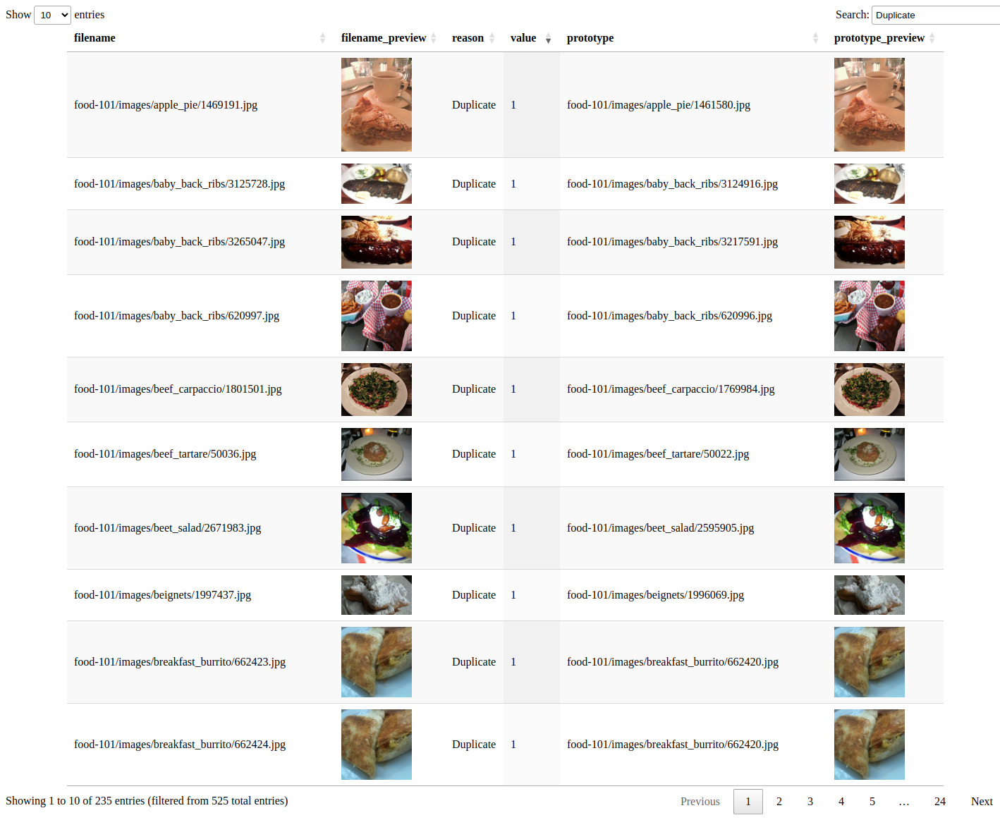
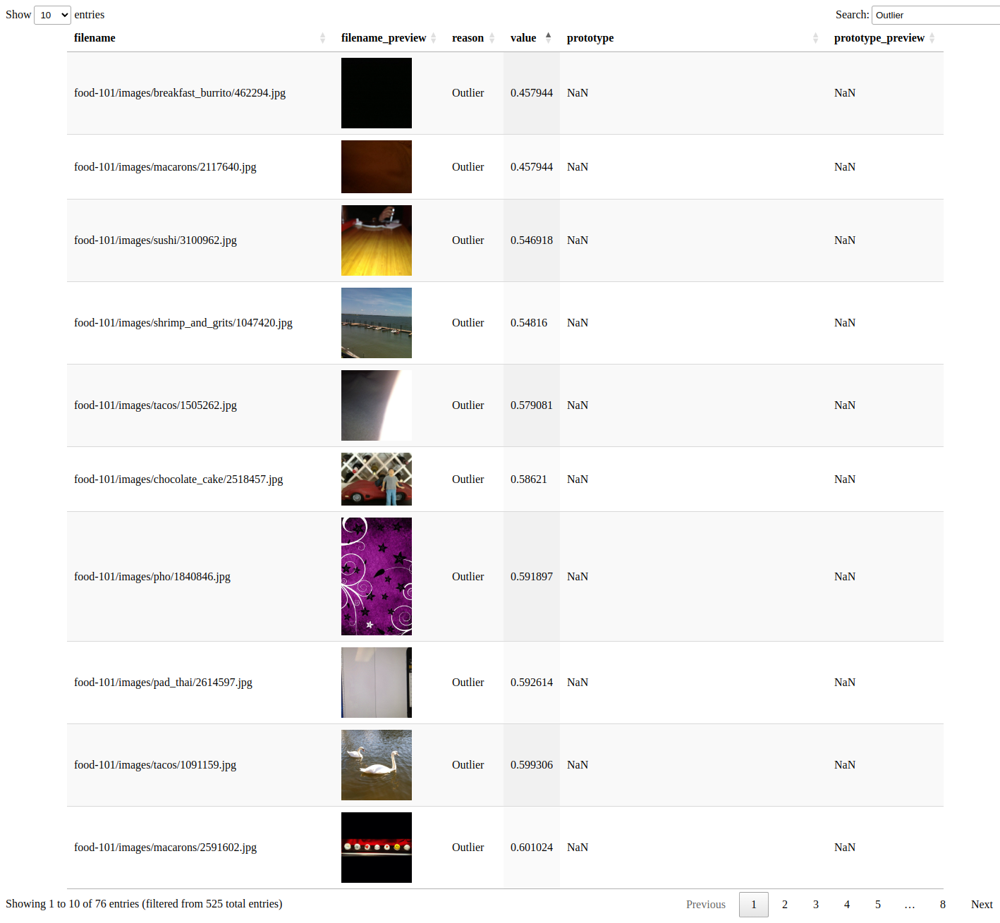
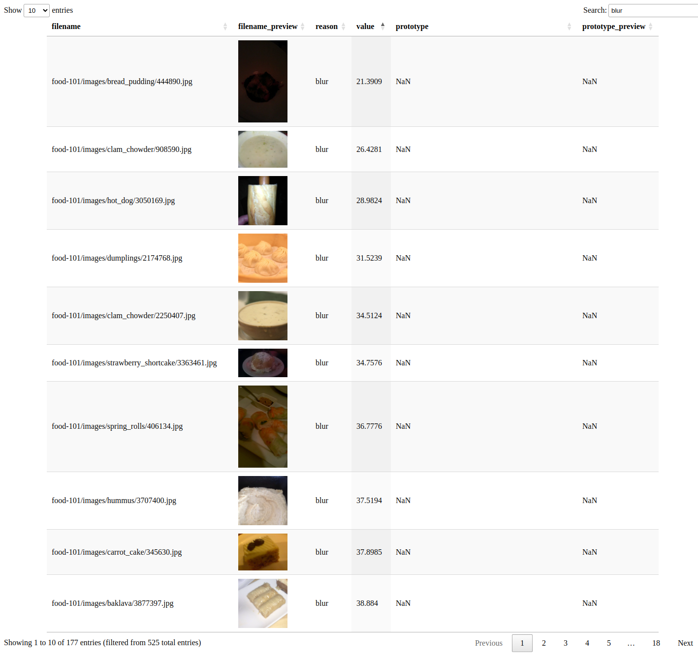
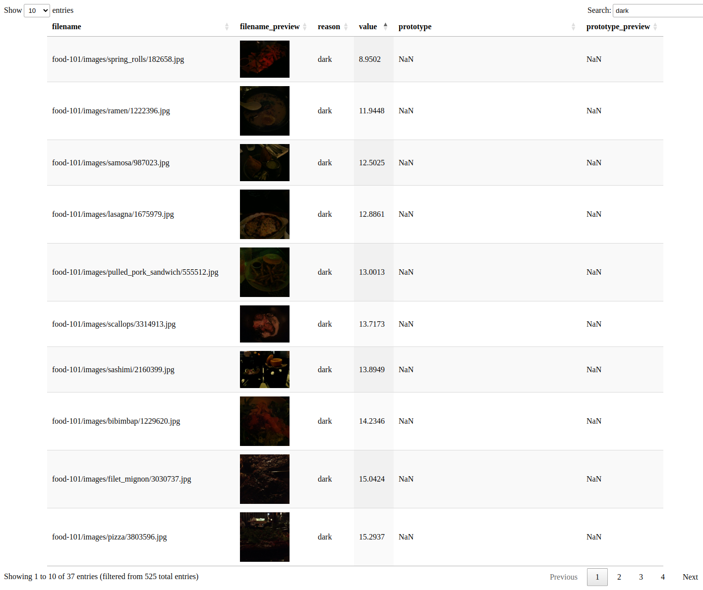
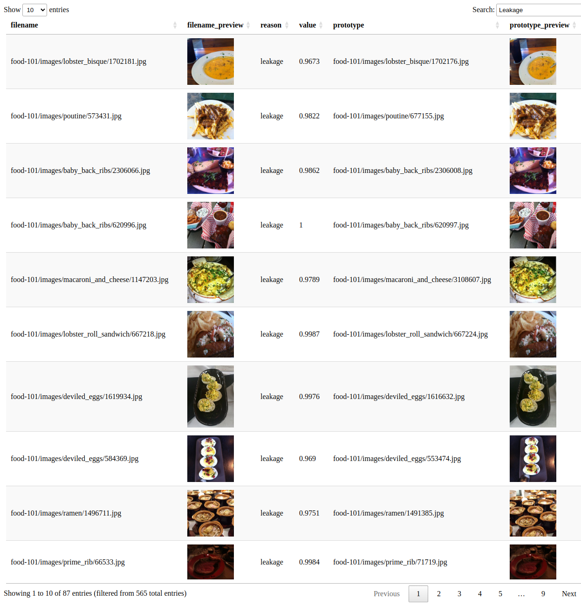

# Dataset Card - Food101

+ Home page - https://data.vision.ee.ethz.ch/cvl/datasets_extra/food-101/

+ Paper - https://data.vision.ee.ethz.ch/cvl/datasets_extra/food-101/static/bossard_eccv14_food-101.pdf

+ License - Unknown.

+ Total images in dataset - 101,000.

## Summary

A challenging data set of 101 food categories is introduced, consisting of 101,000 images. Each class includes 250 manually reviewed test images and 750 training images. The training images deliberately retain some noise, primarily intense colors and occasional incorrect labels. All images have been rescaled to a maximum side length of 512 pixels.

## Issues Found
Here are some of the issues found in each dataset split.

Overall:

| **Reason**    | **Count** | **Percent** |
|---------------|-----------|-------------|
| **Duplicate** | 235       | 0.233       |
| **Blur**      | 185       | 0.183       |
| **Outlier**   | 77        | 0.076       |
| **Dark**      | 43        | 0.043       |
| **Leakage**   | 87        | 0.345       |
| **TOTAL**     | 627       | 0.88        |

Train Split:

| **Reason**    | **Count** | **Percent** |
|---------------|-----------|-------------|
| **Duplicate** | 180       | 0.178       |
| **Blur**      | 145       | 0.144       |
| **Outlier**   | 72        | 0.071       |
| **Dark**      | 43        | 0.043       |
| **TOTAL**     | 440       | 0.436       |

Test Split:

| **Reason**    | **Count** | **Percent** |
|---------------|-----------|-------------|
| **Duplicate** | 55        | 0.054       |
| **Blur**      | 40        | 0.04        |
| **Outlier**   | 5         | 0.005       |
| **Leakage**   | 87        | 0.345       |
| **Duplicate** | 55        | 0.054       |
| **Total**     | 242       | 0.498       |

### 1. Duplicates

### 2. Outliers

### 3. Blur

### 4. Dark

### 5. Leakage

