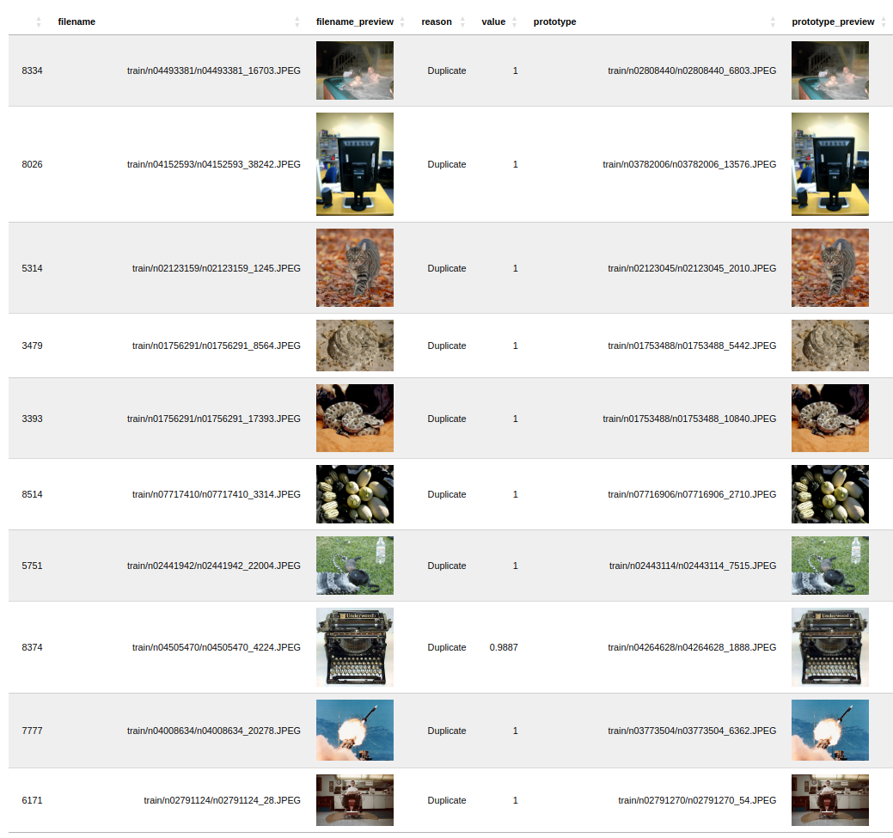
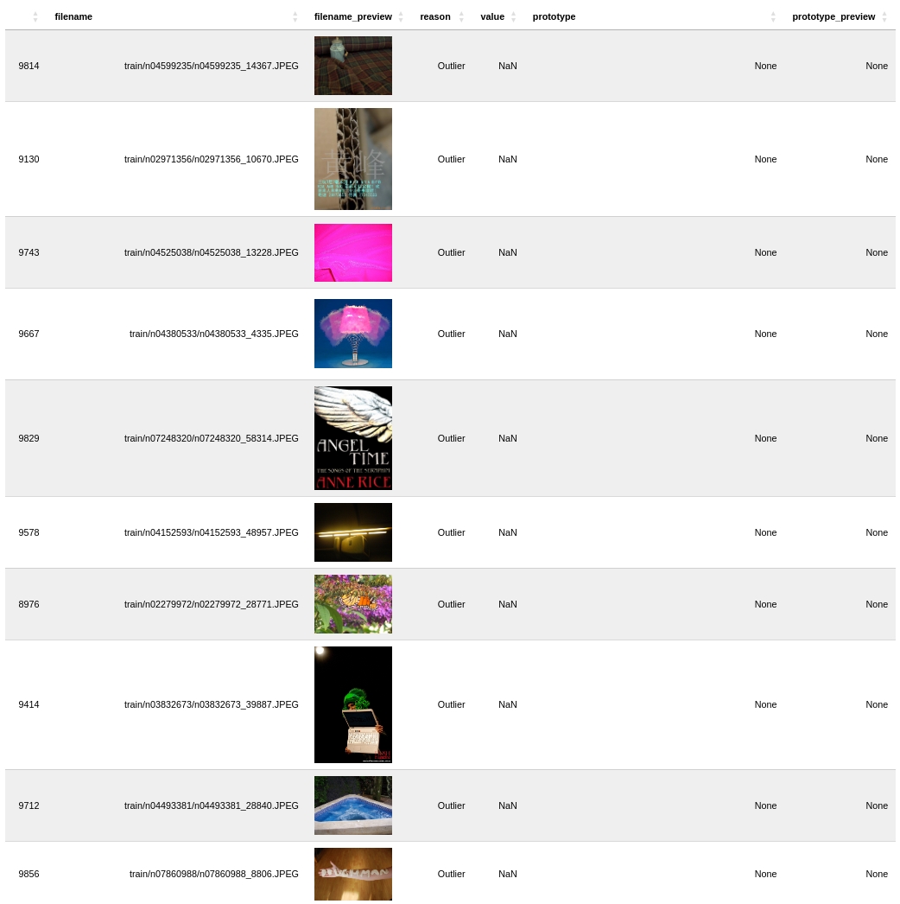
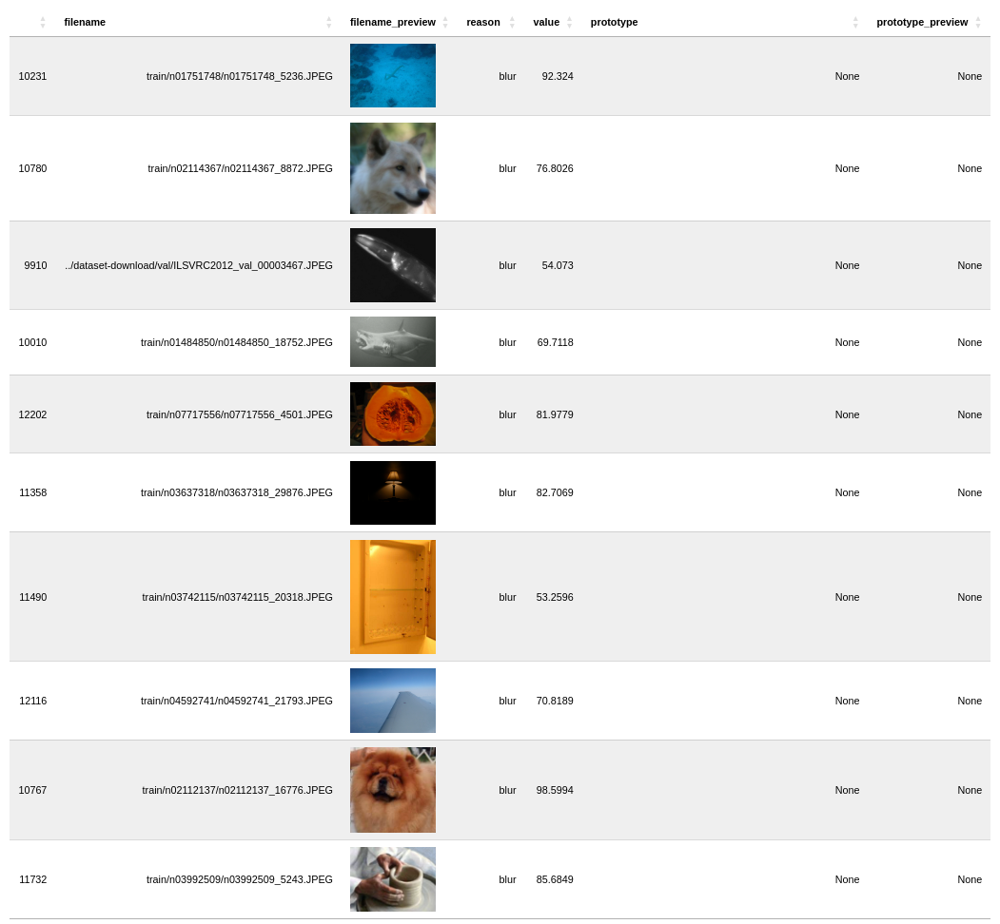
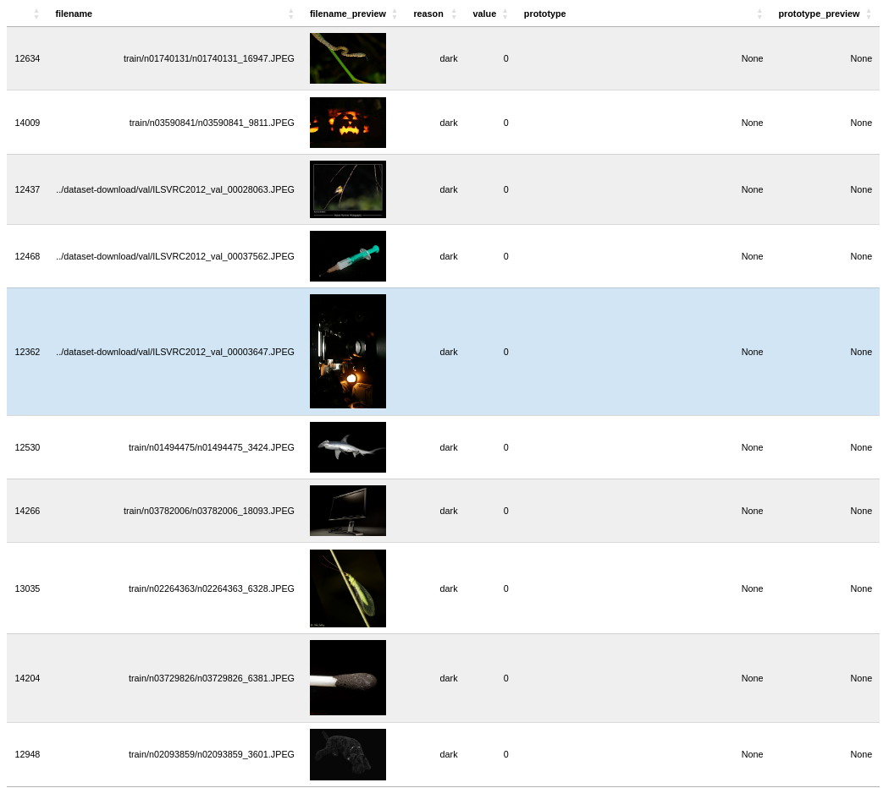
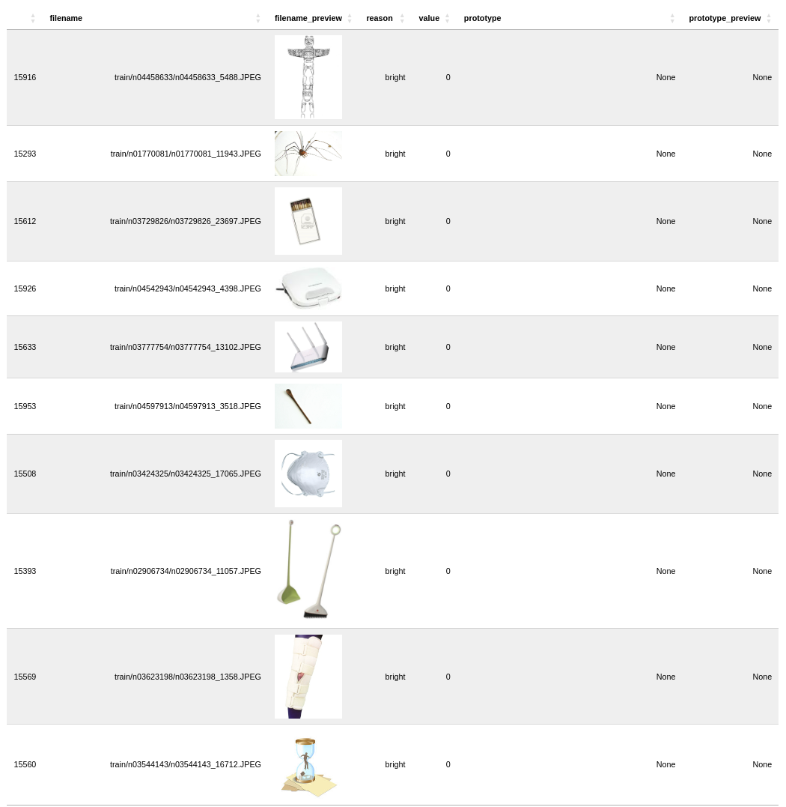
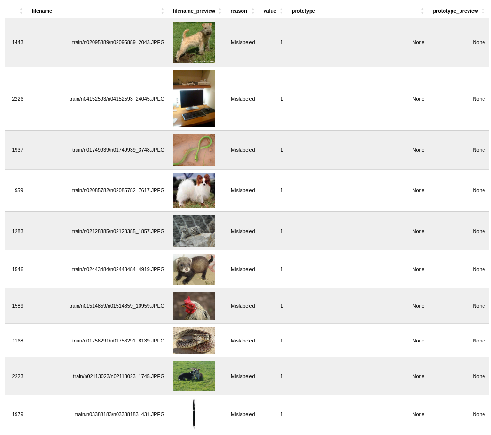

# Dataset Card - ImageNet-1K

+ Home page - https://www.image-net.org/

+ Paper - https://arxiv.org/abs/1409.0575

+ License - Unknown.

+ Total images in dataset - 1,431,167.

## Summary
This dataset provides access to the most commonly used subset of ImageNet, with 1000 object classes, 1,281,167 training images, 50,000 validation images, and 100,000 test images. It includes a patch for corrupted test set images. For the full ImageNet dataset, visit the download section of the main website.

## Issues Found
Here are some of the issues found in each dataset split.

Overall:
| **Reason**     | **Count** | **Percent** |
|----------------|-----------|-------------|
| **Duplicate**  | 7522      | 0.565       |
| **Dark**       | 3174      | 0.238       |
| **Blur**       | 2478      | 0.186       |
| **Mislabeled** | 1480      | 0.111       |
| **Outlier**    | 1199      | 0.09        |
| **Bright**     | 770       | 0.058       |
| **Leakage**    | 869       | 1.738       |
| **TOTAL**      | 17492     | 2.986       |

Train Split:
| **Reason**     | **Count** | **Percent** |
|----------------|-----------|-------------|
| **Duplicate**  | 7108      | 0.534       |
| **Dark**       | 2999      | 0.225       |
| **Blur**       | 2414      | 0.181       |
| **Mislabeled** | 1480      | 0.111       |
| **Outlier**    | 1159      | 0.087       |
| **Bright**     | 746       | 0.056       |
| **TOTAL**      | 15906     | 1.194       |

Validation Split:
| **Reason**    | **Count** | **Percent** |
|---------------|-----------|-------------|
| **Duplicate** | 414       | 0.031       |
| **Dark**      | 175       | 0.013       |
| **Blur**      | 64        | 0.005       |
| **Outlier**   | 40        | 0.003       |
| **Bright**    | 24        | 0.002       |
| **Leakage**   | 869       | 1.738       |
| **TOTAL**     | 1586      | 1.792       |

### 1. Duplicates

### 2. Outliers

### 3. Blur

### 4. Dark

### 5. Bright

### 6. Mislabels

### 7. Leakage
