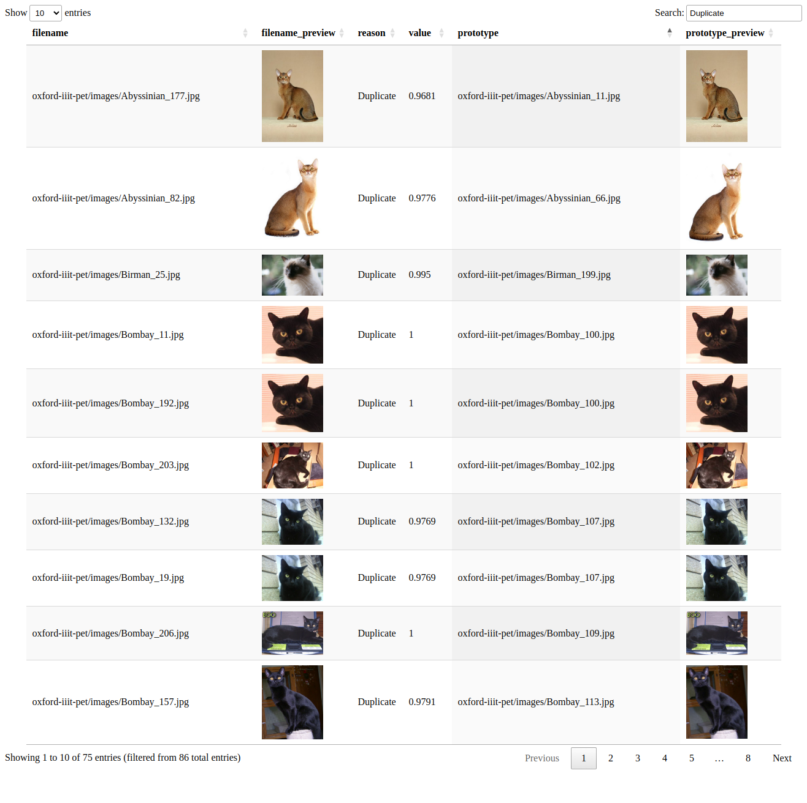
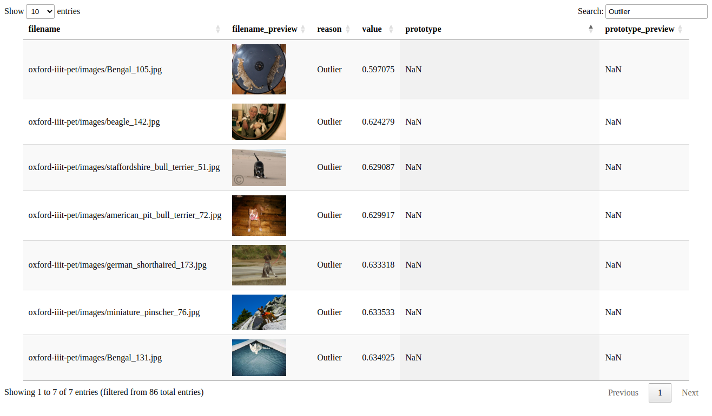
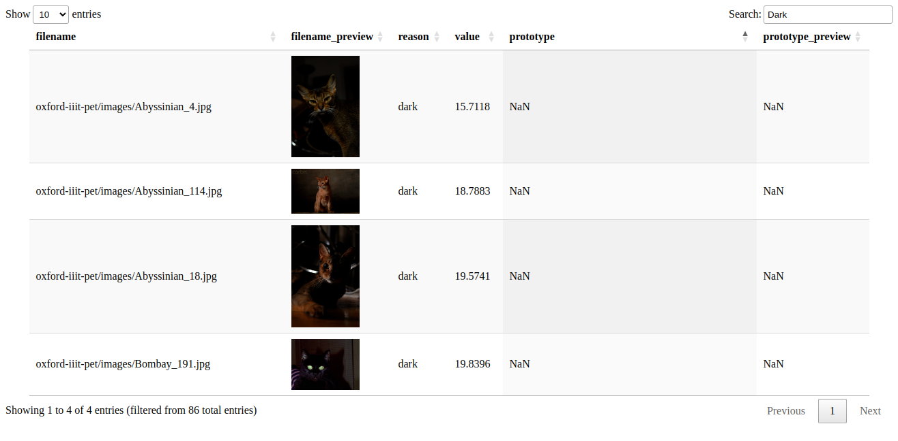

# Dataset Card - Oxford IIIT Pets

+ Home page - https://www.robots.ox.ac.uk/~vgg/data/pets/

+ Paper - https://www.robots.ox.ac.uk/~vgg/publications/2012/parkhi12a/parkhi12a.pdf

+ License - [Creative Commons Attribution-ShareAlike 4.0 International (CC BY-SA 4.0)](https://creativecommons.org/licenses/by-sa/4.0/).

+ Total images in dataset - 7349.

## Summary

The Oxford-IIIT pet dataset comprises 37 categories of pet images, with approximately 200 images per class. The dataset exhibits significant variations in scale, pose, and lighting. Each image is accompanied by a ground truth annotation indicating the breed.

## Issues Found
Here are some of the issues found.

<ol>
<li>Duplicates - 0.59% (43)</li>
<li>Outliers - 0.1% (7)</li>
<li>Dark - 0.05% (4)</li>
<li><b>Total</b> - 0.73% (54)</li>
</ol>

### 1. Duplicates

### 2. Outliers

### 3. Dark
